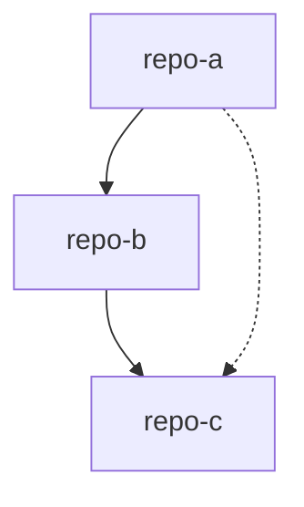

# mistletoe

Mistletoe is a command-line tool for managing multiple Git repositories using a central JSON configuration file. It simplifies operations like cloning, switching branches, status checking, and syncing across multiple projects concurrently.

This project provides two binaries:

*   **`mstl`**: The core tool for standard Git operations (init, status, switch, push, sync, snapshot).
*   **`mstl-gh`**: An extended version that includes all `mstl` features plus GitHub integration (via `gh` CLI) for managing Pull Requests across multiple repositories.

## How to build

This project requires **Go 1.24.3** or higher.

To build the project, run:

```bash
go build -v ./...
```

This will produce the `mstl` and `mstl-gh` binaries in the `cmd/mstl` and `cmd/mstl-gh` directories respectively (or in your current directory depending on your go environment setup, e.g. `go build -o mstl ./cmd/mstl` and `go build -o mstl-gh ./cmd/mstl-gh`).

## Configuration File Format

The core of Mistletoe is the configuration file (usually `repos.json`) containing a list of repositories.

**Example `repos.json`:**

```json
{
  "repositories": [
    {
      "url": "https://github.com/example/repo1.git",
      "branch": "main",
      "id": "my-repo-1"
    },
    {
      "url": "https://github.com/example/repo2.git",
      "revision": "a1b2c3d4",
      "branch": "feature/new-ui",
      "base-branch": "develop"
    }
  ]
}
```

*   **url** (Required): The remote URL of the Git repository.
*   **id** (Optional): The directory name to clone into. If omitted, the name is derived from the URL.
*   **branch** (Optional): The branch to checkout or switch to.
*   **revision** (Optional): A specific commit hash to checkout (primarily used by `init`).
*   **base-branch** (Optional): The base branch for Pull Requests. If omitted, it defaults to the value of `branch`.

## Usage

Both `mstl` and `mstl-gh` follow the same basic usage pattern:

```bash
mstl <command> [options] [arguments]
mstl-gh <command> [options] [arguments]
```

Global options for most commands:
*   `-f, --file <path>`: Path to the configuration file (e.g., `repos.json`).
*   `-p, --parallel <int>`: Number of parallel processes to use (default: 1).

If the `-f` flag is omitted, `mstl` will attempt to read the configuration from **standard input (stdin)**.

Example using pipe:
```bash
cat repos.json | mstl init
```

If you have Base64 encoded input, decode it before piping:
```bash
echo "Base64String" | base64 -d | mstl init
```

### Common Commands (`mstl` & `mstl-gh`)

#### `init`

Initializes repositories defined in the configuration file. It clones repositories if they don't exist and checks out the specified revision or branch.

**Usage:**
```bash
mstl init -f <config_file> [options]
```

**Options:**
*   `--depth <int>`: Create a shallow clone with a history truncated to the specified number of commits.

#### `status`

Displays a status table for all configured repositories, showing the current branch, remote status, and synchronization state.

**Usage:**
```bash
mstl status -f <config_file> [options]
```

**Status Indicators:**
*   `>` (Green): Local branch has unpushed commits.
*   `<` (Yellow): Remote branch has updates (pullable, fast-forward/merge).
*   `x` (Red): Remote branch has updates, but there are conflicts.
*   `-`: Clean (synchronized).

#### `push`

Checks for unpushed commits in all repositories and pushes them to the remote `origin`. It prompts for confirmation before executing the push.

**Usage:**
```bash
mstl push -f <config_file> [options]
```

#### `sync`

Updates repositories by pulling changes from the remote `origin`.
*   If conflicts are detected in any repository, the process aborts.
*   If updates are available, it prompts the user to choose a strategy: `merge`, `rebase`, or `abort`.

**Usage:**
```bash
mstl sync -f <config_file> [options]
```

#### `switch`

Switches the active branch for all configured repositories. It verifies that the branch exists (or can be created) in all repositories before performing the switch.

**Usage:**
```bash
# Switch to an existing branch
mstl switch -f <config_file> [options] <branch_name>

# Create and switch to a new branch
mstl switch -f <config_file> -c <branch_name>
```

**Options:**
*   `-c, --create <branch_name>`: Create a new branch with the specified name and switch to it.

#### `snapshot`

Scans the current directory for subdirectories that are Git repositories and generates a configuration file representing the current state (URL, Branch/Revision).

**Usage:**
```bash
mstl snapshot [options]
```

**Options:**
*   `-o, --output-file <path>`: Path for the output configuration file. (Default: `mistletoe-snapshot-[id].json`)
*   `-f, --file <path>`: Optional configuration file path. Used to resolve the `base-branch` field in the generated snapshot.

#### `version`

Prints the version of the tool and the path to the git executable being used.

**Usage:**
```bash
mstl version
```

#### `help`

Shows usage information and the list of available commands.

**Usage:**
```bash
mstl help
```

### GitHub Extension Commands (`mstl-gh` Only)

The `mstl-gh` binary includes all the commands above, plus the `pr` command for managing Pull Requests.

#### `pr create`

Creates Pull Requests for all repositories defined in the configuration file.
*   It checks for unpushed commits and pushes them.
*   It creates a PR targeting the configured base branch (or default).
*   It generates a snapshot of the current state and appends it to the PR body.
*   It cross-references other PRs created in the same batch.

**Usage:**
```bash
mstl-gh pr create -f <config_file> [options]
```

**Options:**
*   `-t, --title <string>`: Title of the Pull Request.
*   `-b, --body <string>`: Body content of the Pull Request.
*   `-d, --dependencies <path>`: Path to a Markdown file containing a Mermaid dependency graph.
*   If title/body are omitted, the default editor is opened.

If `--dependencies` is provided, the graph content is embedded in the PR body (hidden in a details block with a Mermaid preview), and related PRs are categorized based on the graph.

**Example dependencies file (`dependencies.md`):**

````markdown

````

**Visualization:**


You can define dependencies as a Mermaid graph.

#### `pr status`

Displays the status of Pull Requests associated with the current branches of the configured repositories.

**Usage:**
```bash
mstl-gh pr status -f <config_file> [options]
```
