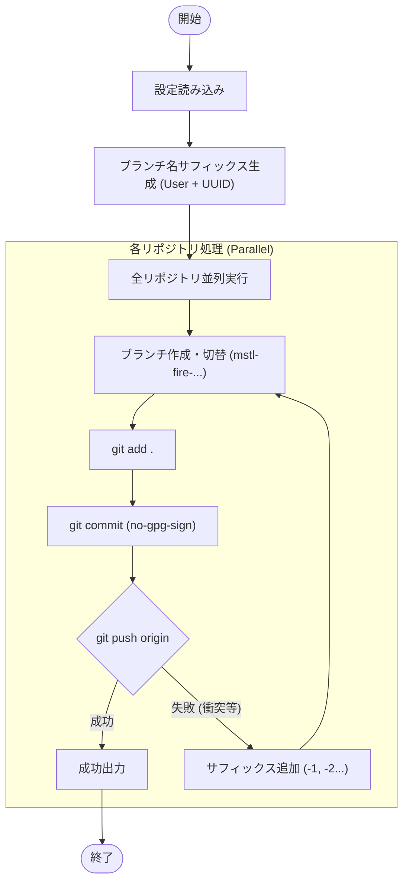

# `fire` サブコマンド Design Doc

## 1. 概要 (Overview)

`fire` サブコマンドは、緊急時に現在の作業状況を即座に保存・退避するためのコマンドです。
設定されたすべてのリポジトリに対して、一意のブランチを作成し、すべての変更をステージング・コミットして、リモートへプッシュします。
この操作はユーザー対話を一切行わず、GPG署名もスキップして、可能な限り迅速かつ確実に変更を退避させることを優先します。

## 2. 使用方法 (Usage)

```bash
mstl fire
# または
mstl-gh fire
```

### オプション (Options)

`fire` コマンドにはオプションはありません。すべてデフォルトの動作で実行されます。
また、実行時の `--yes` オプションと同様に、プロンプトでの確認は一切行われません。

## 3. ロジックフロー (Logic Flow)

実行フローは、**設定読み込み**、**並列実行**のフェーズで構成されます。各リポジトリではブランチ名衝突時のリトライロジックが組み込まれています。

### 3.1. フローチャート (Flowchart)



### 3.2. ブランチ命名規則 (Branch Naming)

退避用のブランチ名は以下のように自動生成されます。

`mstl-fire-[repo_id]-[username]-[uuid]`

*   `repo_id`: 設定ファイル (`config.json`) で定義されたリポジトリID
*   `username`: 実行ユーザー名（英数字のみにサニタイズ）
*   `uuid`: ランダムな短い16進文字列（衝突防止用）

### 3.3. 実行詳細 (Execution Details)

1.  **設定読み込み**:
    *   通常のコマンド同様、`.mstl/config.json` を読み込みます。オプション指定がないため、カレントディレクトリまたは親ディレクトリを探索します。

2.  **Git 操作とリトライロジック**:
    *   以下の手順を最大5回までリトライします。リトライ毎にブランチ名に連番サフィックス（例: `-1`, `-2`）が付与されます。

    1.  **Checkout**: `git checkout -b <branch_name>`
        *   リモートブランチの事前確認 (`git ls-remote`) は行いません。
    2.  **Add**: `git add .` (新規ファイル・変更・削除をすべて対象)
    3.  **Commit**: `git commit -m "Emergency commit..." --no-gpg-sign`
        *   `--no-gpg-sign` により、GPGパスワード入力待ちで処理が止まることを防ぎます。
    4.  **Push**: `git push -u origin <branch_name>`
        *   Pushに失敗した場合（同名ブランチが競合して既に存在する場合など）は、警告ログを出力し、次のリトライ（名前変更）へ移行します。

3.  **並列性**:
    *   `config.json` の `jobs` 設定に従い、可能な限り並列で実行します。

4.  **エラーハンドリング**:
    *   リトライ回数を超えても成功しなかった場合、またはGit操作で致命的なエラーが発生した場合はエラーログを出力し、そのリポジトリの処理を終了します。他のリポジトリの処理は継続します。
