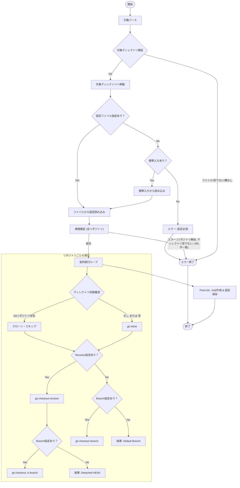

# `init` サブコマンド Design Doc

## 1. 概要 (Overview)

`init` サブコマンドは、設定ファイルで指定されたリポジトリをクローンおよび構成することで、ローカル環境を初期化します。設定ファイルで定義された状態とローカル環境が一致することを保証し、並列実行とシャロークローン（shallow clone）をサポートします。

## 2. 使用方法 (Usage)

```bash
mstl init --file <path> [options]
# または
cat config.json | mstl init [options]
```

### オプション (Options)

| オプション | 短縮形 | 説明 | デフォルト |
| :--- | :--- | :--- | :--- |
| `--file` | `-f` | 設定ファイル (JSON) のパス。標準入力を使用する場合は省略可 | `.mstl/config.json` |
| `--dest` | | init処理を行う対象ディレクトリ。存在しない場合は作成される（親ディレクトリは存在必須） | `.` (現在のディレクトリ) |
| `--depth` | | 指定されたコミット数に履歴を切り詰めてシャロークローンを作成 | 0 (フルクローン) |
| `--jobs` | `-j` | クローン/チェックアウトに使用する並列プロセス数 | 1 |
| `--ignore-stdin` | | 標準入力を無視する | false |
| `--verbose` | `-v` | デバッグ用の詳細ログを出力（実行された git コマンドを表示） | false |

## 3. 設定構造 (Configuration Structure)

このコマンドは、リポジトリのリストを含む JSON 設定ファイルを想定しています。

```json
{
  "repositories": [
    {
      "url": "https://github.com/example/repo.git",
      "id": "repo-directory-name",
      "branch": "main",
      "revision": "commit-hash",
      "private": false
    }
  ]
}
```

*   **url**: (必須) リモートリポジトリの URL
*   **id**: (任意) リポジトリのディレクトリ名。省略された場合、URL のベース名（末尾）から `.git` を除いたものが ID となる (例: `.../repo.git` -> `repo`, `.../repo` -> `repo`)。ID (自動生成されたものを含む) は設定ファイル内で一意である必要あり
*   **branch**: (任意) チェックアウト対象のブランチ
*   **revision**: (任意) チェックアウト対象のコミットハッシュ
*   **private**: (任意) 非公開リポジトリとしてマークするブール値。デフォルトは `false`。`true` に設定された場合、エクスポートされる設定ファイルや依存関係グラフから除外される

### 3.1. 入力検証 (Input Validation)

セキュリティと誤動作防止のため、以下の検証を行います。

1.  **ID (ディレクトリ名)**
    *   **許可される文字**: 英数字、ハイフン (`-`)、アンダースコア (`_`)、ドット (`.`) のみ
    *   **禁止**: パストラバーサル (`..`)、絶対パス、ディレクトリ区切り文字 (`/`, `\`)、および OS で予約された文字や制御文字の使用禁止
    *   **一意性**: すべてのリポジトリ ID の重複不可

2.  **URL**
    *   **プロトコル**: `ext::` プロトコル（Git の脆弱性要因になり得る）の使用禁止
    *   **制御文字**: 改行などの制御文字を含まないこと

3.  **Branch / Revision**
    *   **許可される文字**: 英数字、ハイフン (`-`)、アンダースコア (`_`)、ドット (`.`)、スラッシュ (`/`)
    *   **形式**: 先頭がハイフン (`-`) でないこと（コマンドラインオプションとしての誤解釈防止のため）

## 4. ロジックフロー (Logic Flow)

実行フローは、**設定の読み込み**、**環境検証**、**並列実行**で構成されます。

### 4.1. フローチャート (Flowchart)



### 4.2. 環境検証 (Environment Validation)

書き込み操作を行う前に、`init` は環境を検証し、整合性を確保してデータ損失を防ぎます。いずれかの検証で失敗した場合、コマンドは直ちに中止されます。

#### 4.2.1. 対象ディレクトリの検証 (Destination Validation)

`--dest` オプションで指定されたパス（デフォルトは `.`）に対して以下の検証を行います。

*   **存在確認**:
    *   **存在する場合**: パスがディレクトリであることを確認します（空である必要はありません）。ファイルである場合はエラーとなります。
    *   **存在しない場合**: 親ディレクトリ（parent）が存在し、かつディレクトリであることを確認します。親が存在しない場合やファイルの場合はエラーとなります。条件を満たす場合、対象ディレクトリを作成します。

検証成功後、プロセスは対象ディレクトリに移動（`chdir`）し、以降の処理はすべてそのディレクトリ内で行われます。

#### 4.2.2. リポジトリ環境の検証 (Repository Validation)

各リポジトリについて以下の検証を行います。

1.  **適格性チェック (Eligibility Check)**
    ターゲットディレクトリが存在する場合、以下の条件を満たしているか確認します。
    *   Git リポジトリとして設定されている
    *   `remote.origin.url` が設定ファイルと一致する
    *   設定ファイルに `branch` が記載されている場合、そのブランチが存在する（ローカルまたはリモート）
    *   設定ファイルに `base-branch` が記載されている場合、そのブランチが存在する（ローカルまたはリモート）
    *   設定ファイルに `revision` が記載されている場合、そのリビジョンが存在する（ローカル）

2.  **ディレクトリの整合性**
    *   **適格である場合**: 通常の init 処理（チェックアウト等）を行います。
    *   **不適格である場合**:
        *   ディレクトリが **空である** 場合、init 処理（クローン等）を行います。
        *   ディレクトリが **空でない** 場合、エラーとなり処理を中断します。

### 4.3. 実行ロジック (Execution Logic)

リポジトリは並列に処理されます（`--jobs` で指定された上限まで）。

1.  **クローン (Cloning)**
    *   ディレクトリが存在しないか、空である場合に実行
    *   ターゲットパスに有効な Git リポジトリが既に存在する場合はスキップ
    *   指定されている場合、`--depth` の適用（クローン時のみ）

2.  **チェックアウト / 切り替え (Checkout / Switch)**
    *   **Revision と Branch**: 特定の `revision` をチェックアウト（Detached HEAD）した後、`branch` を作成またはリセット（`git checkout -B`）
    *   **Revision のみ**: `revision` をチェックアウトし、リポジトリを Detached HEAD 状態に変更
    *   **Branch のみ**: 既存の `branch` への切り替え
    *   **どちらもなし**: クローン後、何もしない（デフォルトブランチのまま）

### 4.4. 初期化後の処理 (Post-Initialization)

すべてのリポジトリ処理が完了した後、以下の処理が行われます。

1.  **ディレクトリ作成**: `.mstl` ディレクトリを `--dest` で指定されたディレクトリ直下に作成します。
2.  **設定保存**: メモリ上の設定情報を `.mstl/config.json` として保存します。この際、`private: true` が設定されたリポジトリは除外されます。元の設定ファイルをコピーするのではなく、メモリ上のデータをJSONとして書き出します。
3.  **依存関係グラフ生成**: メモリ上のリポジトリ一覧を基に、依存関係のないノードのみの Mermaid グラフを生成し、`.mstl/dependency-graph.md` として保存します。この際も、`private: true` が設定されたリポジトリは除外されます。

### 4.5 デバッグ (Debugging)

`--verbose` オプションが指定された場合、実行される `git` コマンドが標準エラー出力に出力されます。
