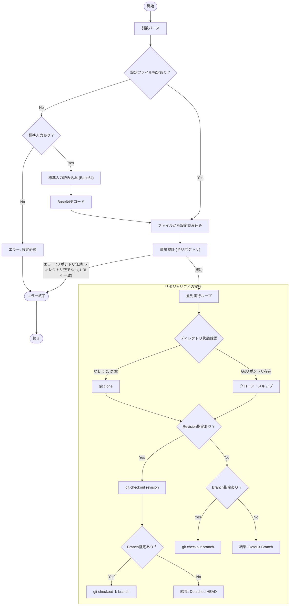

# `init` サブコマンド Design Doc

## 1. 概要 (Overview)

`init` サブコマンドは、設定ファイルで指定されたリポジトリをクローンおよび構成することで、ローカル環境を初期化します。設定ファイルで定義された状態とローカル環境が一致することを保証し、並列実行とシャロークローン（shallow clone）をサポートします。

## 2. 使用方法 (Usage)

```bash
mstl init --file <path> [options]
# または
cat config.json | mstl init [options]
```

### オプション (Options)

| オプション | 短縮形 | 説明 | デフォルト |
| :--- | :--- | :--- | :--- |
| `--file` | `-f` | 設定ファイル (JSON) のパス。標準入力を使用する場合は省略可。標準入力を使用する場合、データは Base64 エンコードされている必要があります。 | - |
| `--depth` | | 指定されたコミット数に履歴を切り詰めてシャロークローンを作成。 | 0 (フルクローン) |
| `--parallel` | `-p` | クローン/チェックアウトに使用する並列プロセス数。 | 1 |

## 3. 設定構造 (Configuration Structure)

このコマンドは、リポジトリのリストを含む JSON 設定ファイルを想定しています。

```json
{
  "repositories": [
    {
      "url": "https://github.com/example/repo.git",
      "id": "repo-directory-name",
      "branch": "main",
      "revision": "commit-hash"
    }
  ]
}
```

*   **url**: (必須) リモートリポジトリの URL。
*   **id**: (任意) リポジトリのディレクトリ名。省略された場合、URL のベース名（末尾）から `.git` を除いたものが ID となります (例: `.../repo.git` -> `repo`, `.../repo` -> `repo`)。ID (自動生成されたものを含む) は設定ファイル内で一意である必要があります。
*   **branch**: (任意) チェックアウト対象のブランチ。
*   **revision**: (任意) チェックアウト対象のコミットハッシュ。

### 3.1. 入力検証 (Input Validation)

セキュリティと誤動作防止のため、以下の検証を行います。

1.  **ID (ディレクトリ名)**:
    *   **許可される文字**: 英数字、ハイフン (`-`)、アンダースコア (`_`)、ドット (`.`) のみ。
    *   **禁止**: パストラバーサル (`..`)、絶対パス、ディレクトリ区切り文字 (`/`, `\`)、および OS で予約された文字や制御文字の使用禁止。
    *   **一意性**: すべてのリポジトリ ID の重複不可。

2.  **URL**:
    *   **プロトコル**: `ext::` プロトコル（Git の脆弱性要因になり得る）の使用禁止。
    *   **制御文字**: 改行などの制御文字を含まないこと。

3.  **Branch / Revision**:
    *   **許可される文字**: 英数字、ハイフン (`-`)、アンダースコア (`_`)、ドット (`.`)、スラッシュ (`/`)。
    *   **形式**: 先頭がハイフン (`-`) でないこと（コマンドラインオプションとしての誤解釈防止のため）。

## 4. ロジックフロー (Logic Flow)

実行フローは、**設定の読み込み**、**環境検証**、**並列実行**で構成されます。

### 4.1. フローチャート (Flowchart)



### 4.2. 環境検証 (Environment Validation)

書き込み操作を行う前に、`init` は環境を検証し、整合性を確保してデータ損失を防ぎます。いずれかのリポジトリでチェックが失敗した場合、コマンドは直ちに中止されます。

1.  **ディレクトリの整合性**:
    *   ターゲットディレクトリが存在するが、Git リポジトリで **ない** 場合、そのディレクトリは空であること（ファイルが含まれている場合、検証失敗）。
    *   ターゲットディレクトリが存在し、かつ Git リポジトリで **ある** 場合、その `remote.origin.url` は設定と一致すること。

2.  **ブランチ競合チェック**:
    *   リポジトリに対して `revision` と `branch` の両方が指定されている場合、コマンドはそのリビジョンから新しいブランチを作成しようとします。
    *   検証では、指定された `branch` が既に存在するか（ローカルまたはリモート）の確認。存在する場合、既存のブランチの上書きを防ぐために検証失敗。

### 4.3. 実行ロジック (Execution Logic)

リポジトリは並列に処理されます（`--parallel` で指定された上限まで）。

1.  **クローン (Cloning)**:
    *   ディレクトリが存在しないか、空である場合に実行。
    *   ターゲットパスに有効な Git リポジトリが既に存在する場合はスキップ。
    *   指定されている場合、`--depth` の適用（クローン時のみ）。

2.  **チェックアウト / 切り替え (Checkout / Switch)**:
    *   **Revision と Branch**: 特定の `revision` をチェックアウト（Detached HEAD）した後、`branch` を作成（`git checkout -b`）。
    *   **Revision のみ**: `revision` をチェックアウトし、リポジトリを Detached HEAD 状態に変更。
    *   **Branch のみ**: 既存の `branch` への切り替え。
    *   **どちらもなし**: クローン後、何もしない（デフォルトブランチのまま）。
