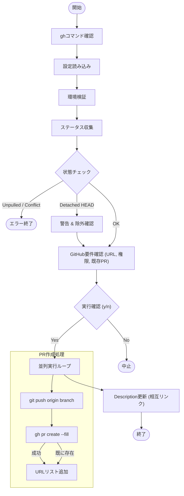

# `pr` サブコマンド Design Doc (mstl-gh)

## 1. 概要 (Overview)

`pr` サブコマンド（`mstl-gh` 専用）は、複数のリポジトリにまたがる変更を一括でプッシュし、GitHub 上で Pull Request (PR) を作成します。作成された PR は互いにリンク（Cross-link）され、説明文（Description）に関連する PR の一覧が追記されます。これにより、マイクロサービス構成などにおける複数リポジトリの同時変更レビューを容易にします。

## 2. 使用方法 (Usage)

```bash
mstl-gh pr create [options]
```

### オプション (Options)

| オプション | 短縮形 | 説明 | デフォルト |
| :--- | :--- | :--- | :--- |
| `--file` | `-f` | **(必須)** 設定ファイル (JSON) のパス。 | - |
| `--parallel` | `-p` | 処理に使用する並列プロセス数。 | 1 |

## 3. 前提条件 (Prerequisites)

*   `gh` (GitHub CLI) がインストールされており、認証済みであること。
*   操作対象のリポジトリに対して `WRITE` 以上の権限を持っていること。

## 4. 動作仕様 (Specifications)

1.  **環境検証**:
    *   `gh` コマンドの有無と認証状態を確認します。
    *   リポジトリの整合性を確認します（`ValidateRepositoriesIntegrity`）。
2.  **ステータス確認**:
    *   全リポジトリの状態を確認します。
    *   **Unpulled Commit (Sync required)** がある場合、または **Conflict** がある場合はエラー終了します。
    *   **Detached HEAD** 状態のリポジトリは PR 作成に参加できないため、警告を表示して処理から除外します（ユーザー確認あり）。
3.  **権限と既存 PR の確認**:
    *   対象リポジトリが GitHub 上にあるか確認します。
    *   現在のユーザーが書き込み権限を持っているか確認します。
    *   現在のブランチですでに PR が存在するか確認します。
4.  **実行 (Push & Create)**:
    *   並列実行で `git push` を行います。
    *   `gh pr create --fill` を実行して PR を作成します。
    *   既に PR が存在する場合は作成をスキップしますが、後続のリンク処理には含めます。
5.  **リンク更新 (Cross-linking)**:
    *   今回作成された（または既存の）すべての PR の URL を集約します。
    *   各 PR の説明文（Description）の末尾に、関連する PR のリストを追記します。

## 5. 内部ロジック (Internal Logic)

### 5.1. フローチャート (Flowchart)



### 5.2. 詳細ロジック

1.  **`verifyGithubRequirements`**:
    *   リポジトリ URL が `github.com` を含んでいるか。
    *   `gh repo view --json viewerPermission` で権限を確認（ADMIN, MAINTAIN, WRITE）。
    *   `gh pr list --head <branch>` で既存 PR を確認。

2.  **`executePrCreation`**:
    *   `git push origin <current-branch>` を実行。
    *   既存 PR がある場合はスキップ。
    *   ない場合は `gh pr create --fill --base <config-branch>` を実行。

3.  **`updatePrDescriptions`**:
    *   取得した全 PR の URL リストを元にフッターテキストを作成。
    *   `gh pr view` で現在の Body を取得し、フッターを追記して `gh pr edit` で更新。
