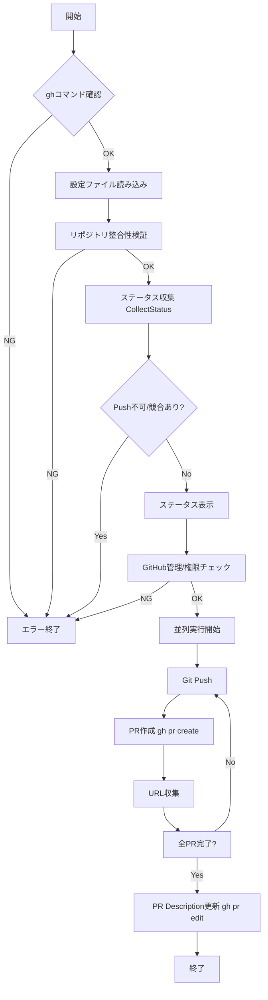

# pr サブコマンド

## 概要

`pr` サブコマンドは、複数のGitHubリポジトリに対して一括でPull Request (PR) を作成・管理するための機能を提供します。
`gh` コマンド (GitHub CLI) を内部的に利用します。

## 仕様

### コマンド体系

```bash
mstl-gh pr create [options]
```

### オプション

*   `--file`, `-f`: 設定ファイル (デフォルト: `repos.json` または `mistletoe.json` などを解決)
*   `--parallel`, `-p`: 並列実行数 (デフォルト: 1)

### 動作フロー

1.  **前提条件チェック**:
    *   `gh` コマンドが利用可能であり、認証済みであることを確認します (`gh auth status`)。
2.  **設定読み込み & 検証**:
    *   指定された設定ファイルを読み込みます。
    *   リポジトリの整合性 (ディレクトリ存在、Gitリポジトリであるか、リモートURLの一致) を検証します。
3.  **状態確認 (Status Check)**:
    *   各リポジトリのステータスを取得します。
    *   以下の条件を満たさないリポジトリがある場合、エラーとして終了します。
        *   **Push可能であること**: Pullが必要な変更 (RemoteがLocalより進んでいる) がないこと。
        *   **競合がないこと**: 競合状態でないこと。
    *   確認後、`status` コマンド相当のテーブルを表示します。
4.  **GitHub要件チェック**:
    *   すべてのリポジトリがGitHub管理下であることを確認します (URLチェック)。
    *   すべてのリポジトリでPR作成権限があることを確認します。
    *   条件を満たさないリポジトリがある場合、エラーとして終了します。
5.  **実行 (Execution)**:
    *   以下の処理を並列実行します。
        1.  **Push**: `git push origin <current_branch>` を実行します。
        2.  **PR作成**: `gh pr create --fill` を実行し、作成されたPRのURLを取得します。
6.  **事後処理 (Post-processing)**:
    *   すべてのPR作成が完了した後、各PRのDescriptionを更新し、相互リンク (Related Pull Request(s)) を追記します。

## 内部ロジック

### 処理フローチャート



### エラーハンドリング

*   各フェーズ (検証、GitHubチェック) で問題が見つかった場合、処理を中断しエラーメッセージを表示します。
*   並列実行中のエラーは収集され、可能な限り報告されますが、致命的なエラー (Push失敗など) はそのリポジトリの処理を中断します。

### 依存関係

*   `internal/app/status_logic.go`: ステータス収集ロジックを再利用
*   `internal/app/utils.go`: Git実行、並列制御
*   `os/exec`: `gh` コマンドの実行
