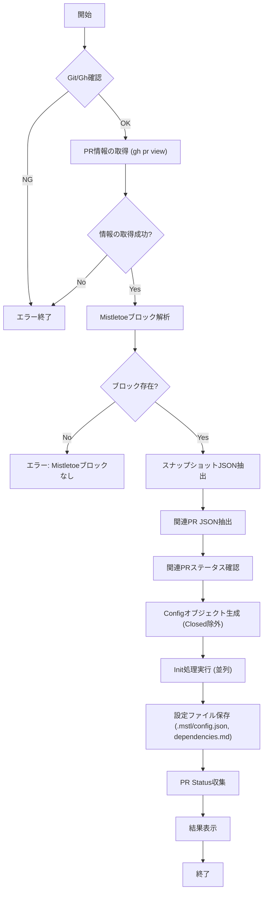

# pr checkout

## 概要
`pr checkout`コマンドは、Mistletoeによって管理されているPull RequestのURLを指定し、そのPull Requestに記載された構成情報（スナップショット）に基づいて、手元のリポジトリ群の状態を復元・同期するためのコマンドです。

## 仕様

### コマンドラインインターフェース
```bash
mstl-gh pr checkout -u [PRのURL] [-p parallel] [options]
```

*   **オプション**:
    *   `-u`, `--url`: **必須**。対象となるGitHub Pull RequestのURL。
    *   `--dest`: 展開先のディレクトリパス（デフォルトはカレントディレクトリ）。`init` コマンドと同等の挙動（ディレクトリの作成や移動）を行います。
    *   `-p`, `--parallel`: 並列実行数（デフォルトは設定または1）。
    *   `-v`, `--verbose`: デバッグ用の詳細ログを出力（実行された git/gh コマンドを表示）

### 動作要件
1.  **環境確認**:
    *   `git`コマンドが利用可能であることを確認します。
    *   `gh` (GitHub CLI) コマンドが利用可能であり、認証済みであることを確認します。
    *   指定されたURLのPull Requestへアクセス可能であることを確認します。
2.  **情報の取得**:
    *   指定されたPRの本文（Body）を取得します。
    *   本文内のMistletoeブロックを解析し、以下の情報を抽出します。
        *   スナップショット情報（JSON形式）: 各リポジトリのURL、リビジョン、ブランチ情報。
        *   関連Pull Request情報（JSON形式）: 依存関係や他の関連PRのURL。
3.  **関連PRの状態検証**:
    *   関連Pull Request情報に含まれるすべてのURLについて、現在のステータスを問い合わせます。
    *   OpenまたはDraft状態のPull Requestのみを有効な依存関係とみなします。
    *   MergedまたはClosed状態のPull Requestに紐づくリポジトリについては、スナップショット情報から除外（スキップ）し、初期化対象としません。
4.  **初期化・同期 (Init)**:
    *   フィルタリング済みのスナップショット情報を設定ファイル（Config）とみなします。
    *   `init` コマンド相当のロジックを実行し、リポジトリのクローンおよび指定されたリビジョン/ブランチへのチェックアウトを行います。
5.  **設定ファイル保存**:
    *   同期完了後、以下のファイルを `.mstl` ディレクトリに保存します。
        *   `config.json`: 使用したスナップショット情報（フィルタリング後）。ただし、`private: true` が設定されたリポジトリは出力から除外されます。
        *   `dependencies.md`: Mistletoeブロックに依存関係グラフ（Mermaid）が含まれている場合、その内容。ただし、`private: true` が設定されたリポジトリに関連するノードおよびエッジは除外されます。
6.  **ステータス表示**:
    *   同期完了後、`pr status` コマンド相当のロジックを実行し、現在のリポジトリ状態とPRの対応状況を表形式で表示します。

### エラーハンドリング
*   `gh`コマンドが未インストールまたは未認証の場合はエラー終了します。
*   指定されたURLが有効なMistletoe管理のPRでない（Mistletoeブロックが見つからない、または破損している）場合はエラー終了します。
*   リポジトリの同期中にエラーが発生した場合（権限不足、ネットワークエラー等）、可能な限り処理を続行し、最後にエラーを報告します。

## 内部ロジック

### フローチャート



### コンポーネント詳細

1.  **Mistletoeブロック解析**:
    *   PR本文から `## Mistletoe` ヘッダーとセパレーターで囲まれたブロックを特定します。
    *   ブロック内の `<details>` タグに含まれるJSONブロックを探し、スナップショットと関連PR情報をデコードします。
    *   スナップショットにはBase64エンコードされたブロックも存在しますが、可読性のあるJSONブロックを優先して読み込みます（または整合性チェックとして両方見ます）。

2.  **Init処理の再利用**:
    *   既存の `internal/app/init.go` 内のロジックをリファクタリングし、`Config` オブジェクト（または `[]Repository`）を受け取ってクローン・チェックアウトを行う共通関数 `PerformInit` を作成し、これを呼び出します。

3.  **Status処理の再利用**:
    *   既存の `internal/app/pr.go` 内の `CollectPrStatus` および `RenderPrStatusTable` を使用して結果を表示します。

4.  **デバッグ**:
    *   `--verbose` オプション指定時、実行された `git` および `gh` コマンドとその出力が表示されます。スピナーは無効化されます。
