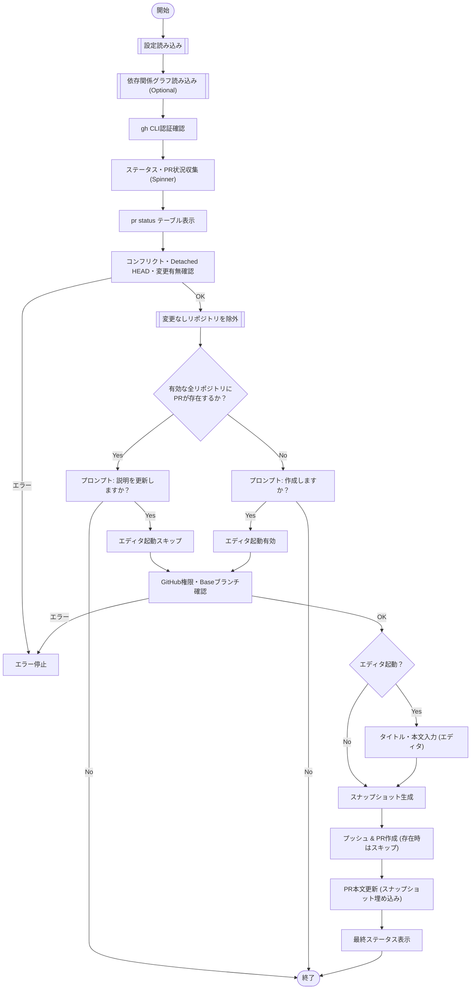

# `pr create` サブコマンド Design Doc (mstl-gh)

## 1. 概要 (Overview)

`pr create` サブコマンドは、複数のリポジトリに対して一括でプルリクエスト (PR) を作成します。PR の本文には、全リポジトリの状態を記録したスナップショット情報が自動的に埋め込まれます。
また、依存関係グラフ（Mermaid形式）を指定することで、各PRの本文に関連するPRへのリンクを依存関係（依存・被依存）に基づいて分類して記載することができます。

## 2. 使用方法 (Usage)

```bash
mstl-gh pr create [options]
```

### オプション (Options)

| オプション | 短縮形 | 説明 | デフォルト |
| :--- | :--- | :--- | :--- |
| `--title` | `-t` | PR のタイトル。 | (エディタで入力) |
| `--body` | `-b` | PR の本文。 | (エディタで入力) |
| `--file` | `-f` | 設定ファイル (JSON) のパス。 | `mistletoe.json` |
| `--dependencies` | `-d` | 依存関係グラフ（Mermaid形式）のMarkdownファイルパス。 | (なし) |
| `--verbose` | `-v` | デバッグ用の詳細ログを出力（実行された git/gh コマンドを表示） | false |

## 3. ロジックフロー (Logic Flow)

### 3.1. フローチャート (Flowchart)



### 3.2. 変更検知と除外ロジック (Change Detection & Exclusion)

各リポジトリについて、以下の条件を満たす場合、そのリポジトリはPushおよびPR作成/更新の対象から除外されます。

*   **条件**: ローカルブランチのすべてのコミットが、リモートのBaseブランチ（`origin/<base-branch>`）に既に含まれている場合。
    *   確認方法:
        1.  `git ls-remote origin <base-branch>` でリモートBaseブランチのコミットハッシュを取得。
        2.  `git merge-base --is-ancestor <remote-hash> HEAD` で、リモートのコミットがローカル `HEAD` の祖先であるか（＝含まれているか）を確認。
        3.  祖先である場合、`HEAD` と `<remote-hash>` が同一かどうかを確認。同一であれば「変更なし」と判定。
    *   ローカル環境への影響（fetchによるリモート追跡ブランチの更新など）を避けるため、`fetch` は行わずに判定します。
*   **挙動**:
    *   Pushを行いません。
    *   新規PRを作成しません。
    *   既存PRのDescription更新も行いません。
*   **通知**: 除外されたリポジトリは、処理開始前に一覧表示され、ユーザーに通知されます。

### 3.3. 既存PRの更新スキップ条件 (Skip Update for Closed/Merged PRs)

既存のPull Requestが存在する場合でも、そのステータスが `MERGED` または `CLOSED` である場合、Descriptionの更新（スナップショットの埋め込み）はスキップされます。

### 3.4. 依存関係の解析 (Dependency Parsing)

`--dependencies` オプションで指定されたファイルは以下のルールで解析されます：
*   **形式**: Markdownファイル内のMermaidグラフ（`graph` または `flowchart`）。
*   **矢印と線種**:
    *   有効な有向矢印（Dependency）として、`-->`, `==>`, `-.->` など、末尾が `>` で終わる有向線を抽出します。
    *   `-- "label" -->` や `== label ==>` のようにラベルや装飾が含まれていても、有向矢印であれば依存関係として認識します。
    *   `--o`, `--x`, `---` など、末尾が `>` でない（有向でない）線は無視されます。
*   **方向**:
    *   `A --> B`: A は B に依存する。
    *   `A <--> B`: 相互依存。AはBに依存し、かつBはAに依存する（始点が `<` で始まる場合）。
*   **ノードID**:
    *   `ID["Label"]` や `ID{Label}` の形式であっても、先頭のID部分のみを使用して照合します。
*   **検証**: グラフ内の抽出されたノードIDは、設定ファイル (`repositories` 内の `id`) と一致する必要があります。一致しないIDが含まれる場合はエラーとして終了します。

### 3.5. Mistletoe ブロック (Mistletoe Block)

PR 本文の末尾に、自動生成された不可視（または折りたたみ）ブロックを追加します。

```markdown
(ユーザー入力本文)

------------------ (ランダムな区切り線)
## Mistletoe

### Related Pull Request(s)
...

<details><summary>mistletoe-related-pr-[identifier].json</summary>
... JSON Data ...
</details>

### snapshot

<details><summary>mistletoe-snapshot-[identifier].json</summary>
... JSON Snapshot Data ...
</details>

```
(Base64 encoded JSON data)
```

-------------------------------------
```

区切り線の長さ計算:
*   上部区切り線 (Top): 長さ `N` (4以上16以下のランダムな整数)
*   下部区切り線 (Bottom):
    *   `N` が奇数の場合: `N * 2 - 2`
    *   `N` が偶数の場合: `N * 2 - 1`

ブロック構成要素:
1.  **関連 PR リンク**:
    *   他のリポジトリで作成された関連 PR へのリンク一覧。
    *   `--dependencies` が指定された場合、以下のセクションに分類して記載されます：
        *   **Dependencies**: このリポジトリが依存している先のリポジトリのPR。
        *   **Dependents**: このリポジトリに依存している元のリポジトリのPR。
        *   **Others**: 依存関係がない、またはグラフに含まれないリポジトリのPR。
    *   指定がない場合は、単一のリストとして全関連PRを表示します。
2.  **関連 PR リンク (JSON形式, `<details>` 内)**:
    *   ファイル名: `mistletoe-related-pr-[identifier].json`
    *   内容: 関連PRのURLを分類したJSONデータ。
        ```json
        {
            "dependencies": ["..."],
            "dependents": ["..."],
            "others": ["..."]
        }
        ```
3.  **JSON スナップショット (`<details>` 内)**:
    *   ファイル名: `mistletoe-snapshot-[identifier].json`
    *   内容: 整形された JSON データ。スナップショット内の `base-branch` には設定ファイルの `base-branch`（なければ `branch`）が反映されます。
4.  **Base64 エンコードデータ (コードブロック)**:
    *   目的: 自動処理用の機械可読データの提供。
    *   内容: スナップショット JSON の Base64 エンコード文字列。
    *   **注記**: `<details>` タグの外側に配置し、コードブロックで囲みます。
5.  **依存関係グラフ (`<details>` 内, Optional)**:
    *   条件: `--dependencies` オプション指定時。
    *   summary: `mistletoe-dependencies-[identifier].mmd`
    *   内容: 指定されたMermaidグラフの生データ（`mermaid` コードブロック内）。GitHub上でプレビュー表示されます。

これにより、レビュー担当者はスナップショット情報を参照でき、将来的な自動検証やリンク連携が可能になります。

### 3.6. 制約事項 (Constraints)

*   **GitHub のみ**: URL が GitHub を指していないリポジトリはスキップまたはエラー。
*   **クリーンな状態**: 全てのリポジトリが最新（Up-to-date）であり、ローカルの変更がないことが推奨されますが、実装上は「プッシュ可能であること」の確認。
*   **Detached HEAD 禁止**: ブランチ上にいない（Detached HEAD）リポジトリがある場合、PR 作成先が不明確なためエラー。
*   **Baseブランチの存在**: PRの作成先となるBaseブランチが設定ファイルに指定（`base-branch` 優先、なければ `branch`）されており、かつリモートに存在しない場合、エラーとして終了します。

### 3.7. デバッグ (Debugging)

`--verbose` オプションが指定された場合、実行される `git` および `gh` コマンドが標準エラー出力に出力されます。また、スピナー（進行状況インジケータ）は無効化されます。
