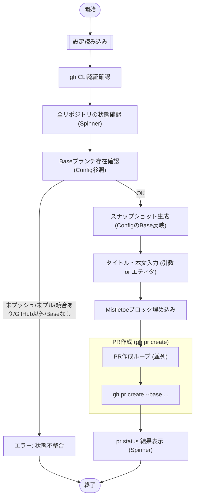

# `pr create` サブコマンド Design Doc (mstl-gh)

## 1. 概要 (Overview)

`pr create` サブコマンドは、複数のリポジトリに対して一括でプルリクエスト (PR) を作成します。PR の本文には、全リポジトリの状態を記録したスナップショット情報が自動的に埋め込まれます。

## 2. 使用方法 (Usage)

```bash
mstl-gh pr create [options]
```

### オプション (Options)

| オプション | 短縮形 | 説明 | デフォルト |
| :--- | :--- | :--- | :--- |
| `--title` | `-t` | PR のタイトル。 | (エディタで入力) |
| `--body` | `-b` | PR の本文。 | (エディタで入力) |
| `--draft` | `-d` | ドラフト PR として作成。 | false |
| `--file` | `-f` | 設定ファイル (JSON) のパス。 | `mistletoe.json` |

## 3. ロジックフロー (Logic Flow)

### 3.1. フローチャート (Flowchart)



### 3.2. Mistletoe ブロック (Mistletoe Block)

PR 本文の末尾に、自動生成された不可視（または折りたたみ）ブロックを追加します。

```markdown
(ユーザー入力本文)

------------------ (ランダムな区切り線)
<details><summary>Mistletoe Snapshot</summary>
... JSON Snapshot Data ...
</details>

```
(Base64 encoded JSON data)
```

-------------------------------------
```

区切り線の長さ計算:
*   上部区切り線 (Top): 長さ `N` (4以上16以下のランダムな整数)
*   下部区切り線 (Bottom):
    *   `N` が奇数の場合: `N * 2 - 2`
    *   `N` が偶数の場合: `N * 2 - 1`

ブロック構成要素:
1.  **JSON スナップショット (`<details>` 内)**:
    *   ファイル名: `mistletoe-snapshot-[identifier].json`
    *   内容: 整形された JSON データ。スナップショット内の `base-branch` には設定ファイルの `base-branch`（なければ `branch`）が反映されます。
2.  **Base64 エンコードデータ (コードブロック)**:
    *   目的: 自動処理用の機械可読データの提供。
    *   内容: スナップショット JSON の Base64 エンコード文字列。
    *   **注記**: `<details>` タグの外側に配置し、コードブロックで囲みます。
3.  **関連 PR リンク**:
    *   他のリポジトリで作成された関連 PR へのリンク一覧。

これにより、レビュー担当者はスナップショット情報を参照でき、将来的な自動検証やリンク連携が可能になります。

### 3.3. 制約事項 (Constraints)

*   **GitHub のみ**: URL が GitHub を指していないリポジトリはスキップまたはエラー。
*   **クリーンな状態**: 全てのリポジトリが最新（Up-to-date）であり、ローカルの変更がないことが推奨されますが、実装上は「プッシュ可能であること」の確認。
*   **Detached HEAD 禁止**: ブランチ上にいない（Detached HEAD）リポジトリがある場合、PR 作成先が不明確なためエラー。
*   **Baseブランチの存在**: PRの作成先となるBaseブランチが設定ファイルに指定（`base-branch` 優先、なければ `branch`）されており、かつリモートに存在しない場合、エラーとして終了します。
