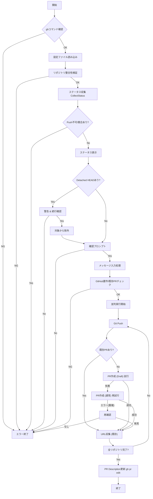

# pr サブコマンド

## 概要

`pr` サブコマンドは、複数のGitHubリポジトリに対して一括でPull Request (PR) を作成・管理するための機能を提供します。
`gh` コマンド (GitHub CLI) を内部的に利用します。

## 仕様

### コマンド体系

```bash
mstl-gh pr create [options]
```

### オプション

*   `--file`, `-f`: 設定ファイル (デフォルト: `repos.json` または `mistletoe.json` などを解決)
*   `--parallel`, `-p`: 並列実行数 (デフォルト: 1)
*   `--title`, `-t`: Pull Requestのタイトル。指定されない場合、かつ `--body` も指定されていない場合はエディタが起動します。
*   `--body`, `-b`: Pull Requestの本文 (Description)。指定されない場合、かつ `--title` も指定されていない場合はエディタが起動します。

### 動作フロー

1.  **前提条件チェック**:
    *   `gh` コマンドが利用可能であり、認証済みであることを確認します (`gh auth status`)。
2.  **設定読み込み & 検証**:
    *   指定された設定ファイルを読み込みます。
    *   リポジトリの整合性 (ディレクトリ存在、Gitリポジトリであるか、リモートURLの一致) を検証します。
3.  **状態確認 (Status Check)**:
    *   各リポジトリのステータスを取得します。
    *   以下の条件を満たさないリポジトリがある場合、エラーとして終了します。
        *   **Push可能であること**: Pullが必要な変更 (RemoteがLocalより進んでいる) がないこと。
        *   **競合がないこと**: 競合状態でないこと。
    *   確認後、`status` コマンド相当のテーブルを表示します。
    *   Detached HEAD状態のリポジトリがある場合は警告し、処理を続行するか確認します。
        *   続行を選択した場合、これらのリポジトリは以降の処理 (GitHub要件チェック、実行) から除外されます。
    *   実行前に確認プロンプトを表示します。
4.  **メッセージ入力**:
    *   `--title` および `--body` オプションが指定されている場合はそれらを使用します。
    *   どちらも指定されていない場合、デフォルトエディタ (`EDITOR` 環境変数、または `vi`/`notepad`) を起動し、ユーザに入力を求めます。
    *   エディタでの入力内容について:
        *   1行目をタイトルとして扱います。
        *   入力された全文 (1行目を含む) を本文 (Description) として扱います。
    *   入力が空の場合は処理を中断します。
5.  **GitHub要件チェック**:
    *   対象リポジトリ (除外済みを除く) がすべてGitHub管理下であることを確認します (URLチェック)。
    *   対象リポジトリすべてでPR作成権限があることを確認します。
    *   **既存PRの確認**: すでにPull Requestが存在するかを確認します。
        *   存在する場合: そのURLを記録し、後続の「PR作成」ステップはスキップしますが、「Push」は実行対象とします。
    *   条件を満たさないリポジトリがある場合、エラーとして終了します。
6.  **実行 (Execution)**:
    *   以下の処理を並列実行します。
        1.  **Push**: `git push origin <current_branch>` を実行します。
        2.  **PR作成**:
            *   既存のPRがない場合、以下の手順で作成を試みます。
                1.  **Draft作成試行**: まず `--draft` オプション付きで `gh pr create` を実行します。
                2.  **通常作成 (フォールバック)**: Draft作成が失敗した場合 (リポジトリ設定やアカウント制約などでDraftがサポートされていない場合)、`--draft` なしで `gh pr create` を再試行します。
            *   **競合回避**: PR作成コマンドが「すでに存在する」というエラーで失敗した場合、再度PRの存在確認を行い、URLが取得できれば「既存のPRがある」とみなして続行します。
            *   既存のPRがある場合: スキップします。
7.  **事後処理 (Post-processing)**:
    *   すべてのPR (新規作成および既存) について、Descriptionを更新し、相互リンク (Related Pull Request(s)) を追記します。

## 内部ロジック

### 処理フローチャート



### エラーハンドリング

*   各フェーズ (検証、GitHubチェック) で問題が見つかった場合、処理を中断しエラーメッセージを表示します。
*   並列実行中のエラーは収集され、可能な限り報告されますが、致命的なエラー (Push失敗など) はそのリポジトリの処理を中断します。
*   エディタ起動失敗時や、エディタを保存せずに終了した(空入力)場合は中断します。

### 依存関係

*   `internal/app/status_logic.go`: ステータス収集ロジックを再利用
*   `internal/app/utils.go`: Git実行、並列制御
*   `os/exec`: `gh` コマンドの実行
