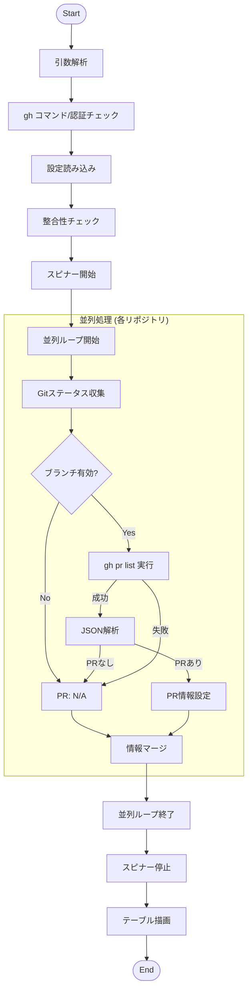

# PR Status サブコマンド設計書

## 概要

`mstl-gh pr status` コマンドは、設定ファイルで管理されているリポジトリの、Localリポジトリの状態とPull Requestの状態を一覧表示する機能を提供する。

## 仕様

### コマンド

```bash
mstl-gh pr status [options]
```

### オプション

*   `--file`, `-f`: 設定ファイルのパスを指定する。
*   `--parallel`, `-p`: 並列実行数を指定する（デフォルト: 1）。

### 動作

1.  **初期化**: 引数の解析、設定ファイルの読み込み。
2.  **`gh` チェック**: `pr create` 同様、`gh` コマンドがインストールされ、認証済み (`gh auth status`) であることを確認する。
3.  **検証**: 各リポジトリの整合性（ディレクトリ存在、Gitリポジトリ、Remote URL一致）を検証する。
4.  **ステータス収集 (並列 & プログレス)**:
    *   プログレススピナーを表示する。
    *   GitステータスとPRステータスの収集を並列実行する。
    *   **Gitステータス**: Branch, Rev, Ahead/Behind/Conflict。
    *   **PRステータス**: `gh pr list` コマンドを使用してPull Request情報を取得する。
        *   検索条件: `repo` (URL), `head` (Local Branch Name).
        *   取得項目: Number, State, IsDraft, URL, BaseRefName.
5.  **表示**:
    *   スピナーを停止する。
    *   収集した情報を結合し、テーブル形式で標準出力に表示する。

### 出力テーブル

| Repository | PR | Base | Branch/Rev | Status |
|---|---|---|---|---|
| repo1 | #1 - Draft | main | feature/abc | > |
| repo2 | #2 - Ready | develop | fix/def | < |
| repo3 | N/A | | main/ghi | |

*   **Repository**: リポジトリIDまたはディレクトリ名。
*   **PR**: PR番号と状態（Draft/Ready）。該当なしまたはエラー時は `N/A`。
*   **Base**: PRのターゲットブランチ（Base）。設定ファイルの `branch` 指定がある場合はそれを優先的に表示の目安とするが、基本はPR情報のBaseRefName。
*   **Branch/Rev**: ローカルのブランチ名とShort SHA。
*   **Status**:
    *   `>` (緑): 未プッシュのコミットあり (Ahead)。
    *   `<` (黄): プル可能なコミットあり (Behind)。
    *   `!` (黄): 競合あり (Conflict)。

## 内部ロジック

### フローチャート



### 注意事項

*   `gh` コマンドがインストールされ、認証されている必要がある。
*   `gh` コマンドの実行はネットワークリクエストを伴うため、並列実行 (`--parallel`) が推奨される。
*   Detached HEAD状態のリポジトリはPR情報の取得対象外（N/A）となる。
