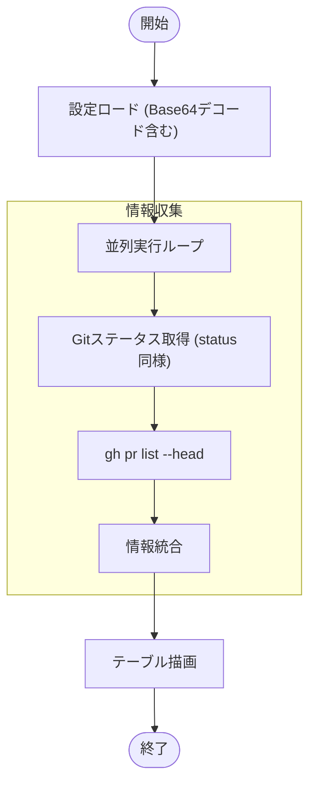

# `pr status` サブコマンド Design Doc (mstl-gh)

## 1. 概要 (Overview)

`pr status` サブコマンドは、各リポジトリに関連付けられた現在のプルリクエスト (PR) の情報を表示します。ローカルのステータス情報と GitHub 上の PR 情報を統合して表示します。

## 2. 使用方法 (Usage)

```bash
mstl-gh pr status [options]
```

### オプション (Options)

| オプション | 短縮形 | 説明 | デフォルト |
| :--- | :--- | :--- | :--- |
| `--file` | `-f` | 設定ファイル (JSON) のパス。未指定の場合は標準入力からの読み込みを試みます。標準入力を使用する場合、データは Base64 エンコードされている必要があります。 | `mistletoe.json` |
| `--parallel` | `-p` | 並列プロセス数。 | 1 |

## 3. 出力形式 (Output Format)

```text
+------------+--------+---------------+--------+------------------------------------------+
| REPOSITORY | BASE   | BRANCH/REV    | STATUS | PR                                       |
+------------+--------+---------------+--------+------------------------------------------+
| frontend   | main   | feature/ui    |   <    | https://github.com/org/frontend/pull/123 |
| backend    | main   | feature/api   |   >    | -                                        |
| tools      | develop| fix/bug       |   -    | https://github.com/org/tools/pull/456    |
+------------+--------+---------------+--------+------------------------------------------+
```

*   **BASE**: PR のベースブランチ、または設定上のブランチ。
*   **BRANCH/REV**: ローカルの現在のブランチまたはリビジョン。
*   **STATUS**: ローカル Git ステータス ( `<` Pullable, `>` Unpushed, `!` Conflict )。
*   **PR**: PR の URL。存在しない場合はハイフン。

## 4. ロジックフロー (Logic Flow)

### 4.1. フローチャート (Flowchart)



### 4.2. 統合ロジック

1.  `status` コマンドと同様に、ローカルおよびリモートの Git 情報の収集。
2.  `gh` CLI を使用して、現在のブランチに関連する PR の検索。
3.  PR が見つかった場合、その URL を表示。見つからない場合、ハイフンを表示。
