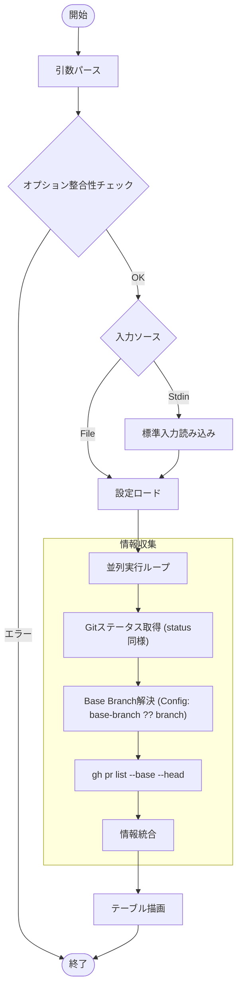

# `pr status` サブコマンド Design Doc (mstl-gh)

## 1. 概要 (Overview)

`pr status` サブコマンドは、各リポジトリに関連付けられた現在のプルリクエスト (PR) の情報を表示します。ローカルのステータス情報と GitHub 上の PR 情報を統合して表示します。

## 2. 使用方法 (Usage)

```bash
mstl-gh pr status [options]
```

### オプション (Options)

| オプション | 短縮形 | 説明 | デフォルト |
| :--- | :--- | :--- | :--- |
| `--file` | `-f` | 設定ファイル (JSON) のパス。 | `.mstl/config.json` |
| `--jobs` | `-j` | 並列プロセス数。 | 1 |
| `--ignore-stdin` | | 標準入力を無視する | false |
| `--verbose` | `-v` | デバッグ用の詳細ログを出力（実行された git/gh コマンドを表示） | false |

**注意**: 同じ種類のオプション（例: `--file` と `-f`）が同時に異なる値で指定された場合はエラーとなります。
**注意**: コマンドラインオプション（例: `--jobs`）は、設定ファイル（`config.json`）内の対応する設定値よりも優先されます。

## 3. 出力形式 (Output Format)

```text
+------------+--------+---------------+--------+------------------------------------------+
| REPOSITORY | BASE   | BRANCH/REV    | STATUS | PR                                       |
+------------+--------+---------------+--------+------------------------------------------+
| frontend   | main   | feature/ui    |   <    | https://github.com/org/frontend/pull/123 |
| backend    | main   | feature/api   |   >    | -                                        |
| tools      | develop| fix/bug       |   -    | https://github.com/org/tools/pull/456    |
+------------+--------+---------------+--------+------------------------------------------+
```

*   **BASE**: PR のベースブランチ（設定ファイルの `base-branch`、なければ `branch`）。
*   **BRANCH/REV**: ローカルの現在のブランチまたはリビジョン。
*   **STATUS**: ローカル Git ステータス ( `<` Pullable, `>` Unpushed, `!` Conflict )。
*   **PR**: PR の URL。存在しない場合はハイフン。

## 4. ロジックフロー (Logic Flow)

### 4.1. フローチャート (Flowchart)



### 4.2. 統合ロジック

1.  `status` コマンドと同様に、ローカルおよびリモートの Git 情報の収集。
2.  設定ファイルから Base Branch を決定します。`base-branch` キーがある場合はそれを使用し、ない場合は `branch` キーを使用します。
3.  `gh` CLI を使用して、指定された Base Branch に向けた、現在のブランチからの PR を検索します。
4.  PR が見つかった場合、その URL を表示。見つからない場合、ハイフンを表示。

### 4.3. デバッグ (Debugging)

`--verbose` オプションが指定された場合、実行される `git` および `gh` コマンドが標準エラー出力に出力されます。また、スピナー（進行状況インジケータ）は無効化されます。
