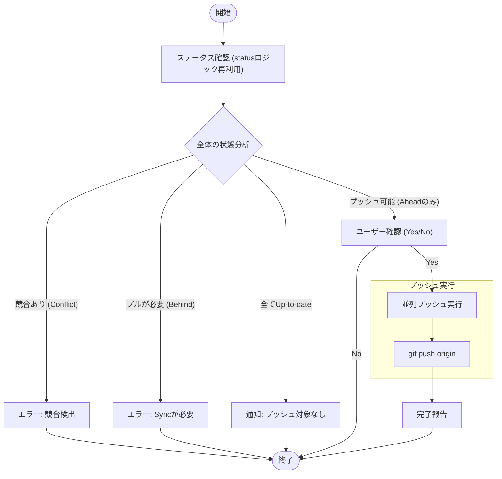

# `push` サブコマンド Design Doc

## 1. 概要 (Overview)

`push` サブコマンドは、ローカルで変更があり（Ahead）、かつリモートと整合性が取れている（Behind でなく、競合がない）リポジトリを一括でプッシュします。

## 2. 使用方法 (Usage)

```bash
mstl push [options]
```

### オプション (Options)

| オプション | 短縮形 | 説明 | デフォルト |
| :--- | :--- | :--- | :--- |
| `--file` | `-f` | 設定ファイル (JSON) のパス。標準入力を使用する場合、データは Base64 エンコードされている必要があります。 | `mistletoe.json` |
| `--parallel` | `-p` | 並列プロセス数。 | 1 |

## 3. ロジックフロー (Logic Flow)

安全なプッシュを行うため、厳密な事前チェックを行います。

### 3.1. フローチャート (Flowchart)



### 3.2. 安全性チェック (Safety Checks)

プッシュを実行する前に、以下の条件を検証します。

1.  **競合なし**: いずれかのリポジトリでコンフリクト（`status` で `x`）が検出された場合、操作のブロック。
2.  **プル不要**: いずれかのリポジトリがリモートより遅れている（`status` で `<`）場合、先に `sync` を促すため、操作のブロック。

これらのチェックにより、「うっかり強制プッシュ」や「コンフリクトの無視」を防ぎます。
