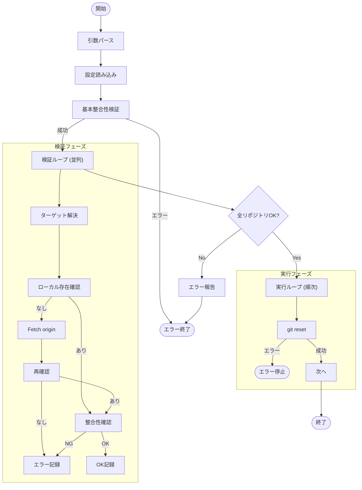

# `reset` サブコマンド Design Doc

## 1. 概要 (Overview)

`reset` サブコマンドは、設定ファイルに記載されたすべてのリポジトリに対して `git reset` (Mixed Reset) を実行し、コミット履歴を指定された特定のポイント（ターゲット）に戻します。
この操作では、ワーキングディレクトリの変更内容は**維持**されます（Unstaged changes として残ります）。
実行前にすべてのリポジトリでリセットが可能かを検証し、実行不可能なリポジトリが一つでもある場合は処理を中断します。

## 2. 使用方法 (Usage)

```bash
mstl reset --file <path> [options]
```

### オプション (Options)

| オプション | 短縮形 | 説明 | デフォルト |
| :--- | :--- | :--- | :--- |
| `--file` | `-f` | 設定ファイル (JSON) のパス。未指定の場合は標準入力からの読み込みを試みます。 | `.mstl/config.json` |
| `--jobs` | `-j` | 検証（`git fetch`, チェック等）に使用する並列プロセス数。 | 1 |
| `--ignore-stdin` | | 標準入力を無視する | false |
| `--verbose` | `-v` | デバッグ用の詳細ログを出力（実行された git コマンドを表示） | false |

**注意**: このコマンドはユーザー確認（プロンプト）を行わず、設定ファイルに基づいてリセットを行います。現在のHEADの位置は移動しますが、作業内容は保持されます。

## 3. ロジックフロー (Logic Flow)

実行フローは、**設定読み込み**、**ターゲット解決・検証**、**リセット実行**のフェーズで構成されます。

### 3.1. ターゲット解決優先順位 (Target Resolution Priority)

各リポジトリについて、以下の優先順位でリセットの基準となるポイント（ターゲット）を決定します。

1.  `revision` (設定ファイル)
2.  `base-branch` (設定ファイル)
3.  `branch` (設定ファイル)

※ いずれも指定されていない場合はエラーとします。

### 3.2. 検証フェーズ (Validation Phase)

リセット実行前に、全リポジトリに対してターゲットへのリセットが可能かを確認します。このフェーズは `--jobs` オプションに従い並列で実行されます。

1.  **ターゲットの特定**: 上記優先順位に従いターゲットを特定。
2.  **ローカル存在確認**: ターゲットがローカルに存在するか確認。
3.  **リモート取得 (必要時)**: ローカルに存在しない場合、リモート (`origin`) から取得 (`git fetch`) を試行。
4.  **整合性確認**:
    *   ターゲットが存在しない場合、エラー。
    *   ターゲットが存在しても、現在の履歴ツリーと全く異なる（unrelated histories）場合など、不整合がある場合はエラーとして扱います。

**判定基準**: 1つでもリセット不可のリポジトリがある場合、プロセス全体をエラーとして終了し、一切のリセットを行いません。

### 3.3. 実行フェーズ (Execution Phase)

検証がすべて成功した場合のみ、順次リセットを実行します。

*   **コマンド**: `git reset <target>` (Mixed reset)
*   **エラーハンドリング**: 実行中にエラーが発生した場合、即座に停止します。

### 3.4. フローチャート (Flowchart)


