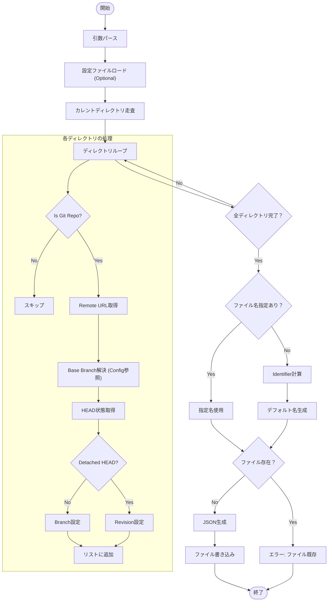

# `snapshot` サブコマンド Design Doc

## 1. 概要 (Overview)

`snapshot` サブコマンドは、現在のディレクトリ直下にあるすべての Git リポジトリをスキャンし、その時点の状態（リモート URL、ブランチ、またはリビジョン）を記録した新しい設定ファイル（JSON）を生成します。現在の環境をスナップショットとして保存する際に使用します。

## 2. 使用方法 (Usage)

```bash
mstl snapshot [options]
```

### オプション (Options)

| オプション | 短縮形 | 説明 | デフォルト |
| :--- | :--- | :--- | :--- |
| `--output-file` | `-o` | 出力する設定ファイルのパス。 | `mistletoe-snapshot-[identifier].json` |
| `--file` | `-f` | 参照元の設定ファイル（ベース情報の取得用）。 | なし |

※ `identifier` は含まれるリポジトリのリビジョン情報のハッシュ値から計算されます。

## 3. 動作仕様 (Specifications)

1.  **ディレクトリ走査**: カレントディレクトリのすべてのサブディレクトリをチェックします。
2.  **Git 判定**: `.git` ディレクトリを持つものだけを対象とします。
3.  **情報抽出**:
    *   **ID**: ディレクトリ名を ID として使用します。
    *   **URL**: `git remote get-url origin` で取得します。失敗時は `git config --get remote.origin.url` を試行します。
    *   **Base Branch**:
        *   オプションで設定ファイル (`-f`) が指定されている場合、その設定にある `base-branch` を使用します。
        *   設定ファイルに `base-branch` がない場合、`branch` の値を `base-branch` として扱います。
        *   設定ファイルが指定されていない場合は設定されません。
    *   **Branch/Revision**:
        *   現在の HEAD がブランチを指している場合、そのブランチ名を `branch` フィールドに設定します。
        *   **Detached HEAD** 状態の場合（ブランチ名が "HEAD"）、現在のコミットハッシュを `revision` フィールドに設定し、`branch` は設定しません。
4.  **ファイル名決定**:
    *   オプションで指定された場合はそのファイル名を使用します。
    *   指定がない場合、スキャンしたリポジトリ情報から識別子（identifier）を計算し、`mistletoe-snapshot-[identifier].json` とします。
5.  **ファイル出力**:
    *   指定されたパス（またはデフォルトパス）にファイルが既に存在する場合は、上書きせずにエラー終了します。
    *   出力形式はインデントされた JSON です。

## 4. 内部ロジック (Internal Logic)

### 4.1. フローチャート (Flowchart)



### 4.2. 詳細ロジック

1.  **設定ファイルのロード**:
    *   `--file` (`-f`) オプションが指定された場合、設定ファイルを読み込みます。
    *   各リポジトリの `base-branch` を解決します（`base-branch` 優先、なければ `branch`）。
2.  **リポジトリ情報の構築**:
    *   `os.ReadDir(".")` でエントリを取得します。
    *   各ディレクトリについて、`rev-parse --abbrev-ref HEAD` を実行します。
        *   戻り値が `HEAD` 文字列そのものであれば、Detached HEAD とみなして `rev-parse HEAD` で完全なハッシュを取得し、`Revision` フィールドに格納します。
        *   それ以外の場合はブランチ名として `Branch` フィールドに格納します。
    *   設定ファイルから解決した `base-branch` を `BaseBranch` フィールドに設定します。
3.  **ファイル名決定**:
    *   `--output-file` (`-o`) が指定されていない場合、`CalculateSnapshotIdentifier` 関数を使用して識別子を計算します。
    *   ファイル名を `mistletoe-snapshot-[identifier].json` とします。
4.  **出力ファイルチェック**: `os.Stat` を使用して出力先ファイルが既に存在するか確認し、存在する場合は誤って上書きしないように終了します。
5.  **出力**:
    *   設定ファイルの構造体（`Config`）において、`Branch`, `BaseBranch`, `Revision` はポインタ型（`*string`）であるため、該当しないフィールドは `nil`（JSON 上では省略または null）として扱われます。
