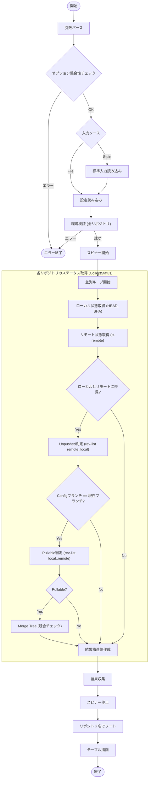

# `status` サブコマンド Design Doc

## 1. 概要 (Overview)

`status` サブコマンドは、設定ファイルで管理されている全リポジトリの現在の状態を一覧表示します。ローカルとリモートの差異（未プッシュ、プル可能、競合）を視覚的に提示し、開発者が複数のリポジトリの同期状態を素早く把握できるようにします。

## 2. 使用方法 (Usage)

```bash
mstl status [options]
```

### オプション (Options)

| オプション | 短縮形 | 説明 | デフォルト |
| :--- | :--- | :--- | :--- |
| `--file` | `-f` | 設定ファイル (JSON) のパス。未指定の場合は標準入力からの読み込みを試みます。 | `.mstl/config.json` |
| `--jobs` | `-j` | ステータス取得に使用する並列プロセス数。 | 1 |
| `--ignore-stdin` | | 標準入力を無視する | false |
| `--verbose` | `-v` | デバッグ用の詳細ログを出力（実行された git コマンドを表示） | false |

**注意**: 同じ種類のオプション（例: `--file` と `-f`）が同時に異なる値で指定された場合はエラーとなります。
**注意**: コマンドラインオプション（例: `--jobs`）は、設定ファイル（`config.json`）内の対応する設定値よりも優先されます。

## 3. 出力形式 (Output Format)

結果はテーブル形式で表示されます。

| カラム | 説明 |
| :--- | :--- |
| **Repository** | リポジトリ名（ID または ディレクトリ名）。 |
| **Config** | 設定ファイルで指定されているブランチまたはリビジョン。 |
| **Local** | ローカルの現在のブランチ名とショートコミットハッシュ（例: `main/a1b2c3d`）。 |
| **Remote** | リモートの最新状態（`git ls-remote` で取得）。ローカルが遅れている場合は黄色で表示。 |
| **Status** | 同期状態を示す記号。 |

### ステータス記号 (Status Symbols)

*   `>` (緑色): **Unpushed**。ローカルに未プッシュのコミットがある状態（Ahead）。
*   `<` (黄色): **Pullable**。リモートに新しいコミットがあり、取り込む必要がある状態（現在のブランチが設定と一致する場合のみ判定）。
*   `!` (黄色): **Conflict**。プルすると競合が発生する状態（Pullable な場合のみ判定）。

## 4. 内部ロジック (Internal Logic)

### 4.1. フローチャート (Flowchart)



### 4.2. 詳細ロジック

ステータス判定は以下の順序で行われます。

1.  **環境検証 (`ValidateRepositoriesIntegrity`)**:
    *   ディレクトリが存在し、かつ Git リポジトリであることを確認。
    *   `remote.origin.url` が設定値と一致するかの確認。

2.  **情報収集**:
    *   **Local**: `git rev-parse --abbrev-ref HEAD` (ブランチ名) および `git rev-parse --short HEAD` (ハッシュ) の取得。
    *   **Remote**: `git ls-remote origin refs/heads/<current-branch>` を実行し、リモートの最新ハッシュの取得。

3.  **状態計算 (`status_logic.go`)**:
    *   **Unpushed (`>`)**: `remote..local` のコミット数が 0 より大きい場合。
    *   **Pullable (`<`)**: 現在のブランチが設定ファイルの `branch` と一致する場合のみ判定。`local..remote` のコミット数が 0 より大きい場合。
        *   リモートオブジェクトがローカルに存在しない場合（`cat-file -e` 失敗）、`git fetch` を試行してから再判定。
    *   **Conflict (`!`)**: Pullable である場合、`git merge-base` で共通祖先を特定し、`git merge-tree` を実行してコンフリクトマーカー（`<<<<<<<`）が含まれるかの確認。

4.  **表示**:
    *   `tablewriter` ライブラリを使用し、各リポジトリの計算結果を整形して出力。
    *   `--verbose` が有効な場合、各処理ステップで実行される git コマンドを標準エラー出力に表示します。
