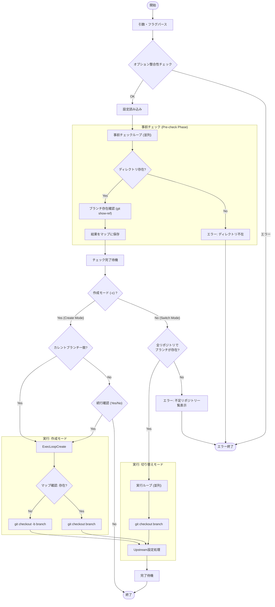

# `switch` サブコマンド Design Doc

## 1. 概要 (Overview)

`switch` サブコマンドは、設定ファイルで定義されたすべてのリポジトリに対して、指定されたブランチへの切り替えを行います。既存のブランチへの切り替えと、新規ブランチの作成・切り替えの両方をサポートし、リポジトリ群全体でのブランチ状態の同期を容易にします。

また、ブランチ切り替え（または作成）後、リモートリポジトリに同名のブランチが存在し、かつ安全（コンフリクトなし）に追跡可能であれば、自動的にそのリモートブランチを Upstream として設定します。

## 2. 使用方法 (Usage)

### 既存ブランチへの切り替え (Switch to existing branch)
```bash
mstl switch <branch_name> --file <path> [options]
```

### 新規ブランチの作成と切り替え (Create and switch)
```bash
mstl switch --create <branch_name> --file <path> [options]
```

### オプション (Options)

| オプション | 短縮形 | 説明 | デフォルト |
| :--- | :--- | :--- | :--- |
| `--file` | `-f` | 設定ファイル (JSON) のパス。未指定の場合は標準入力からの読み込みを試みます。 | `.mstl/config.json` |
| `--create` | `-c` | 指定された名前でブランチを作成（存在しない場合）し、切り替えます。 | - |
| `--jobs` | `-j` | 処理に使用する並列プロセス数。 | 1 |
| `--yes` | `-y` | プロンプト（設定ファイルの自動検索時など）を自動承諾します。 | false |
| `--ignore-stdin` | | 標準入力を無視する | false |
| `--verbose` | `-v` | デバッグ用の詳細ログを出力（実行された git コマンドを表示） | false |

**注意**: 同じ種類のオプション（例: `--file` と `-f`）が同時に異なる値で指定された場合はエラーとなります。
> **注意**: 位置引数としての `<branch_name>` と、`--create` オプションは排他的です。両方を同時に指定するとエラーになります。
**注意**: コマンドラインオプション（例: `--jobs`）は、設定ファイル（`config.json`）内の対応する設定値よりも優先されます。

## 3. ロジックフロー (Logic Flow)

実行フローは、**事前チェックフェーズ**と**実行フェーズ**の2段階で構成されます。特に既存ブランチへの切り替えモードでは、アトミックな動作（全リポジトリにブランチが存在する場合のみ実行）を保証します。

### 3.1. フローチャート (Flowchart)



### 3.2. 詳細挙動 (Detailed Behavior)

#### 事前チェックフェーズ (Pre-check Phase)
すべての設定済みリポジトリに対して並列に以下の確認を行います。
1.  **ディレクトリ存在確認**: リポジトリのディレクトリが存在しない場合、即座にエラー終了します。
2.  **ブランチ存在確認**:
    *   まず、`git show-ref --verify refs/heads/<branch>` を使用して、対象ブランチがローカルに存在するかを確認します。
    *   **ローカルに存在しない場合**、`git fetch origin <branch>` を試行し、続いて `git show-ref --verify refs/remotes/origin/<branch>` でリモートブランチの存在を確認します。
    *   ローカルまたはリモートのいずれかに存在すれば、そのリポジトリでは「ブランチが存在する」と判定し、結果をメモリ上に保存します。
3.  **カレントブランチ取得 (作成モードのみ)**:
    *   `-c` (作成モード) が指定されている場合、現在のブランチ名 (`git rev-parse --abbrev-ref HEAD`) を取得して保存します。

#### 実行モードの分岐

**1. 既存ブランチ切り替えモード (位置引数指定)**
*   **アトミック性チェック**: 保存された結果を確認し、**いずれか一つでも**リポジトリに対象ブランチが存在しない場合、処理の中断。不足しているすべてのリポジトリをリストアップしてエラー表示。これにより、「一部だけ切り替わってしまった」という不整合の防止。
*   **実行**: すべてのリポジトリでブランチが存在することを確認した後、並列で `git checkout <branch>` の実行。
    *   ローカルに存在しないがリモートに存在する場合、`git checkout` により自動的にトラックブランチが作成されます（Gitの標準動作）。
*   **Upstream設定**: 切り替え後、リモートブランチ（`origin/<branch>`）が存在し、コンフリクトがない場合は Upstream に設定します。

**2. 作成モード (`--create` 指定)**
*   **カレントブランチ一貫性チェック**:
    *   すべてのリポジトリの現在のブランチ名が一致しているかを確認します。
    *   一致していない場合、各リポジトリの現在のブランチ名（`[repo_id] branch_name` 形式）を含む警告メッセージを表示し、ユーザーに処理を継続するか確認（yes/no）を求めます。「no」が選択された場合は処理を中止します。
*   厳密な存在チェックは行わず、リポジトリごとの状態に合わせて処理を行います。
*   **実行**:
    *   ブランチが既に存在する場合: `git checkout <branch>` を実行し、そのブランチへの切り替え。
    *   ブランチが存在しない場合: `git checkout -b <branch>` を実行し、新規作成して切り替え。
    *   **Upstream設定**: 切り替え後、リモートブランチ（`origin/<branch>`）が存在し、コンフリクトがない場合は Upstream に設定します。

### 3.3. Upstream設定ロジック (Upstream Logic)
ブランチ切り替え後、以下の手順で自動設定を試みます：
1. `git fetch origin <branch>` を実行し、リモートの状態を更新。
2. リモートブランチ `refs/remotes/origin/<branch>` が存在するか確認。存在しなければ終了。
3. ローカルブランチとリモートブランチの間にコンフリクトがないか確認（Merge Tree等の手法を使用）。コンフリクトがある場合は設定をスキップ。
4. `git branch --set-upstream-to=origin/<branch>` を実行。

### 3.4. デバッグ (Debugging)

`--verbose` オプションが指定された場合、実行される `git` コマンドが標準エラー出力に出力されます。
