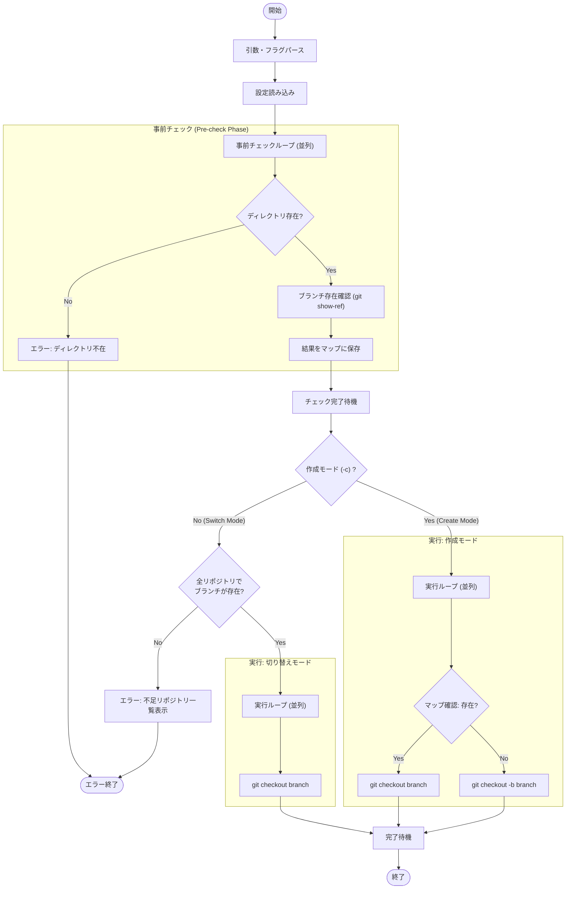

# `switch` サブコマンド Design Doc

## 1. 概要 (Overview)

`switch` サブコマンドは、設定ファイルで定義されたすべてのリポジトリに対して、指定されたブランチへの切り替えを行います。既存のブランチへの切り替えと、新規ブランチの作成・切り替えの両方をサポートし、リポジトリ群全体でのブランチ状態の同期を容易にします。

## 2. 使用方法 (Usage)

### 既存ブランチへの切り替え (Switch to existing branch)
```bash
mstl switch <branch_name> --file <path> [options]
```

### 新規ブランチの作成と切り替え (Create and switch)
```bash
mstl switch --create <branch_name> --file <path> [options]
```

### オプション (Options)

| オプション | 短縮形 | 説明 | デフォルト |
| :--- | :--- | :--- | :--- |
| `--file` | `-f` | 設定ファイル (JSON) のパス。未指定の場合は標準入力からの読み込みを試みます。 | - |
| `--create` | `-c` | 指定された名前でブランチを作成（存在しない場合）し、切り替えます。 | - |
| `--parallel` | `-p` | 処理に使用する並列プロセス数。 | 1 |

> **注意**: 位置引数としての `<branch_name>` と、`--create` オプションは排他的です。両方を同時に指定するとエラーになります。

## 3. ロジックフロー (Logic Flow)

実行フローは、**事前チェックフェーズ**と**実行フェーズ**の2段階で構成されます。特に既存ブランチへの切り替えモードでは、アトミックな動作（全リポジトリにブランチが存在する場合のみ実行）を保証します。

### 3.1. フローチャート (Flowchart)



### 3.2. 詳細挙動 (Detailed Behavior)

#### 事前チェックフェーズ (Pre-check Phase)
すべての設定済みリポジトリに対して並列に以下の確認を行います。
1.  **ディレクトリ存在確認**: リポジトリのディレクトリが存在しない場合、即座にエラー終了します。
2.  **ブランチ存在確認**: `git show-ref --verify refs/heads/<branch>` を使用して、対象ブランチがローカルに存在するかを確認し、結果をメモリ上に保存します。

#### 実行モードの分岐

**1. 既存ブランチ切り替えモード (位置引数指定)**
*   **アトミック性チェック**: 保存された結果を確認し、**いずれか一つでも**リポジトリに対象ブランチが存在しない場合、処理の中断。不足しているすべてのリポジトリをリストアップしてエラー表示。これにより、「一部だけ切り替わってしまった」という不整合の防止。
*   **実行**: すべてのリポジトリでブランチが存在することを確認した後、並列で `git checkout <branch>` の実行。

**2. 作成モード (`--create` 指定)**
*   厳密な存在チェックは行わず、リポジトリごとの状態に合わせて処理を行います。
*   **実行**:
    *   ブランチが既に存在する場合: `git checkout <branch>` を実行し、そのブランチへの切り替え。
    *   ブランチが存在しない場合: `git checkout -b <branch>` を実行し、新規作成して切り替え。
