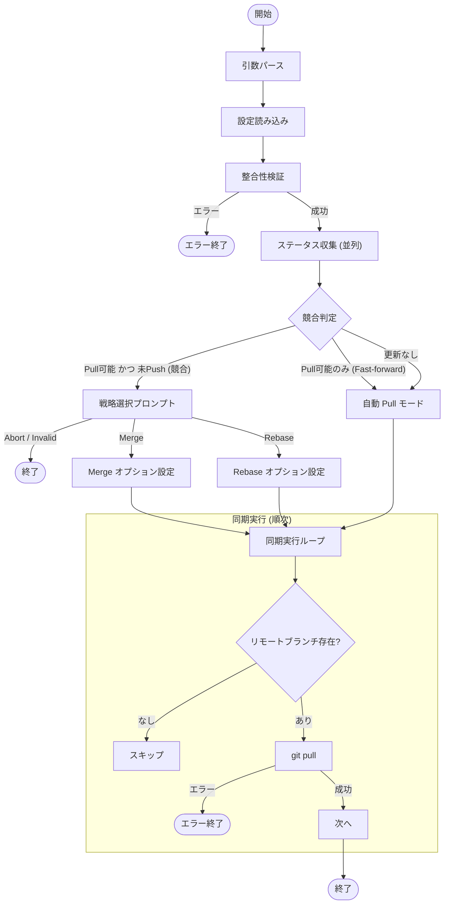

# `sync` サブコマンド Design Doc

## 1. 概要 (Overview)

`sync` サブコマンドは、設定ファイルに記載されたすべてのリポジトリに対して `git pull` を実行し、ローカルの状態をリモートと同期します。競合（Divergence: ローカルとリモートの両方が進んでいる状態）が検出された場合、ユーザーにマージ（Merge）かリベース（Rebase）の戦略を選択させます。

## 2. 使用方法 (Usage)

```bash
mstl sync --file <path> [options]
```

### オプション (Options)

| オプション | 短縮形 | 説明 | デフォルト |
| :--- | :--- | :--- | :--- |
| `--file` | `-f` | 設定ファイル (JSON) のパス。未指定の場合は標準入力からの読み込みを試みます。 | `.mstl/config.json` |
| `--parallel` | `-p` | ステータス確認（`git fetch` 等）に使用する並列プロセス数。 | 1 |
| `--ignore-stdin` | | 標準入力を無視する | false |
| `--verbose` | `-v` | デバッグ用の詳細ログを出力（実行された git コマンドを表示） | false |

## 3. ロジックフロー (Logic Flow)

実行フローは、**設定読み込み**、**ステータス収集**、**戦略決定**、**同期実行**のフェーズで構成されます。

### 3.1. フローチャート (Flowchart)



### 3.2. ステータス収集と判定 (Status Collection & Analysis)

同期を実行する前に、まず全リポジトリの最新状態を確認します。このフェーズでは `--parallel` オプションに従い並列で `git fetch` や `git ls-remote` が実行されます。

収集されたステータスに基づき、以下のロジックで動作を決定します：

1.  **更新の必要性 (Needs Pull)**:
    *   少なくとも1つのリポジトリが `IsPullable`（リモートより遅れている）状態であれば、更新が必要との判断。

2.  **戦略の必要性 (Needs Strategy)**:
    *   リポジトリが `IsPullable`（遅れている）かつ `HasUnpushed`（進んでいる）場合、つまりローカルとリモートが分岐（Diverged）している場合、ユーザー入力の要求。
    *   この場合、ユーザーに `Merge`, `Rebase`, または `Abort` の選択を要求。
    *   分岐しているリポジトリがない場合、プロンプトは表示されず、デフォルトの `git pull`（通常は Fast-forward または設定依存）の実行。

### 3.3. 実行ロジック (Execution Logic)

実際の `git pull` 操作は、安全のため**順次（シーケンシャル）**に実行されます。

*   **対象**: 設定ファイル内の全リポジトリ。ただし、リモートブランチが存在しない（`RemoteRev` が空）リポジトリはスキップ。
*   **エラーハンドリング**: いずれかのリポジトリで `git pull` が失敗した場合、プロセスは即座にエラー終了。これにより、問題のある状態で処理が続行されるのを防止。
*   **デバッグ**: `--verbose` オプション指定時、実行された `git pull` コマンドとその出力が表示されます。
